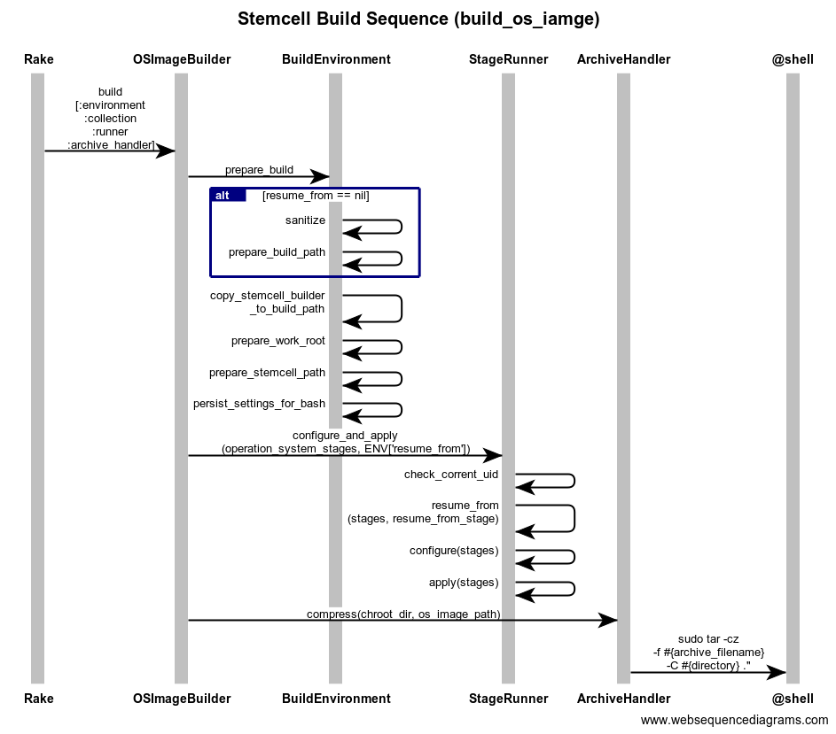

# BOSH linux stemcell builder

Repository: https://github.com/cloudfoundry/bosh-linux-stemcell-builder

기본적으로 프로젝트에 Vagrantfile 이 포함되어 있기 때문에 build 에 필요한 환경을 만들기 위해서는 VirtualBox 와 Vagrant 가 깔려 있으면 된다.
하지만 이를 자동화된 방식으로 반복하기 위해서는 CI 를 활용하는게 나은 방법일 것이고 다음은 Cuncourse CI 를 통한 Build 절차이다.

## Concourse workflow

To create a stemcell on concourse instead of locally on virtualbox, you can execute the build-stemcell task.
```
mkdir /tmp/version
cat <<EOF >/tmp/version/number
0.0
EOF
cd /tmp/version
git init

pushd ~/workspace/bosh-linux-stemcell-builder
fly -t production login
IAAS=vsphere HYPERVISOR=esxi OS_NAME=ubuntu OS_VERSION=trusty time fly -t production execute -p -x -i version=/tmp/version -i bosh-linux-stemcell-builder=. -c ./ci/tasks/build.yml -o stemcell=/tmp/vsphere/dev/
popd
```
Q: 내 local /tmp/version 에 version 정보가 관리되어야 하는가? 지워지면 어떻하지? 버전번호 업데이트는 알아서 해주나?


## Periodic bump

OS images are stored in S3 bucket [bosh-os-images](http://s3.amazonaws.com/bosh-os-images/).

stemcell 에 사용되는 OS Image 는 항상 중요 보안 문제와 심각한 버그들로 부터 안전하게 시스템이 지켜지도록 자동화된 방식으로 지속 업데이트 된다.
특별한 수정사항이 발생한 업데이트의 경우 패치 내용이 기술되지만 정기적인 자동 업데이트의 경우는 Periodic bump 로 기술된다.

## Rakefile

참조: https://github.com/cloudfoundry/bosh-linux-stemcell-builder

프로젝트 최상단에 위치한 Rakefile 은 Stemcell Build Process 의 전체 구조를 살펴보는데 도움이 될 것이다.
Rakefile 에 의하면 총 4 단계를 거쳐 stemcell 이 제작되는 것을 알 수 있다. 만약 S3 와 같은 원격 저장소를
활용하지 않는다면 이를 2 단계로 간소화 할 수 있다.

Rakefile 에 기술된 stemcell build process
1. build_os_image
1. upload_os_image (optional)
1. download_os_image (optional)
1. build(_with_local_os_image) 

S3 를 사용하지 않을때의 stemcell build process
1. build_os_image
1. build_woth_local_os_image

build_os_image
--------------------------------------------------------------------------------
stemcell 의 모체가 되는 OS Image 를 생성한다. 옵션에 따라 Ubuntu / CentOS / ReadHat 등을
선택할 수 있으며 Public 으로 배포되는 ISO Image 에 약간의 hardning 작업을 가해 보안성을 강화하고
bosh 와 관련된 모듈들을 추가 설치한 Image File 이 생성된다


```
title Stemcell Build Sequence (build_os_iamge)
Rake->OSImageBuilder:build\n[:environment\n:collection\n:runner\n:archive_handler]
OSImageBuilder->BuildEnvironment:prepare_build
    alt resume_from == nil
        BuildEnvironment->BuildEnvironment:sanitize
        BuildEnvironment->BuildEnvironment:prepare_build_path
    end
    BuildEnvironment->BuildEnvironment:copy_stemcell_builder\n_to_build_path
    BuildEnvironment->BuildEnvironment:prepare_work_root
    BuildEnvironment->BuildEnvironment:prepare_stemcell_path
    BuildEnvironment->BuildEnvironment:persist_settings_for_bash
OSImageBuilder->StageRunner:configure_and_apply\n(operation_system_stages, ENV['resume_from'])
    StageRunner->StageRunner:check_corrent_uid
    StageRunner->StageRunner:resume_from\n(stages, resume_from_stage)
    StageRunner->StageRunner:configure(stages)
    StageRunner->StageRunner:apply(stages)
OSImageBuilder->ArchiveHandler:compress(chroot_dir, os_image_path)
    ArchiveHandler->@shell:sudo tar -cz \n-f #{archive_filename} \n-C #{directory} ."
```

stemcell 은 StageCollection class 에 정의된 stages 라고 불리우는 묶음을 StateRunner class 를 통해 순차적으로 수행함으로써 OS 이미지를 생성한다. OSImageBuilder 가 StageRunner 를 초기화 할때 StageCollection.operation_system_stages 를 전달하므로 이 states 를 순차적으로 수행할 것이다. IaaS/OS 별로 서로 다른 stages 가 정의되어 있으며 상황에 맞는 state 묶음인 stages 를 정의해 둔 소스가 다음 위치에 있다.

```
bosh_stemcell/lib/bosh/stemcell/state_collection.rb
```

Stage 는 'apply.sh' 에 의해 실행되며 100% 독립적으로 실행될 수 있도록 Stage 간에 의존성이 있으면 안된다. states/ 디렉터리의 하부는 다음과 같이 이루어져 있다.

* apply.sh   state 실행 스크립트
* assets/*   각 asset 은 stage 를 수행하기 위해 필요한 모든 resource 들이 보괸되는 장소이다.
* config.sh  stage 내에서 필요한 local configuration 저장소.

StageCollection.operation_system_stages 를 분석하여 Ubuntu OS Image 를 위한 stages 는 다음과 같이 구성되어 있음을 알게 되었다.

1. base_debootstrap,
1. base_ubuntu_firstboot,
1. base_apt,
1. base_ubuntu_build_essential,
1. base_ubuntu_packages,
1. base_file_permission,
1. base_ssh,
1. bosh_sysstat,
1. system_kernel,
1. system_kernel_modules,
1. system_ixgbevf (Arch.ppc64le 인 경우 생략)
1. **bosh_steps**
    1. bosh_sysctl,
    1. bosh_limits,
    1. bosh_users,
    1. bosh_monit,
    1. bosh_ntpdate,
    1. bosh_sudoers,
1. password_policies,
1. restrict_su_command,
1. tty_config,
1. rsyslog_config,
1. delay_monit_start,
1. system_grub,
1. vim_tiny,
1. cron_config,
1. escape_ctrl_alt_del,
1. system_users,
1. bosh_audit_ubuntu,
1. bosh_log_audit_start,

upload_os_image / download_os_image
--------------------------------------------------------------------------------
build_os_image 에 의해 생성된 image 를 upload/download 한다. 한번 만들어 둔 것을 upload 해
두면 stemcell 제작시 재활용 할 수 있게 된다. local_os_image 를 사용한다면 필요하지 않다.

build(_with_local_os_image)
--------------------------------------------------------------------------------
upload_os_image 에 의해 저장된 원격 저장소를 이용하지 않는다면 build_with_local_os_image 를
사용하면 된다. 만들어진 OS Image 를 Bosh 가 인식할 수 있는 stemcell 이라는 형태로 한번 더 감싸는
작업을 하게 된다.

우선, stages 는 몇개의 큰 카테고리로 분류된다.

* initialize
* operating_system_stages
* extract_operating_system_stages
* agent_stages
* build_stemcell_image_stages
* package_stemcell_stages

또한 StageCollection class 는 Forwardable 이어서 다음 class 들로 적절한 위임이 일어난다.

* definition
* infrastructure
* operating_system
* agent

이제 이렇게 분류해 놓은 stages 는 StemcellBuilder 와 StemcellPackager 에 의해 build 되는데 build 순서는 다음과 같다.

1. StemcellBuilder
    1. extract_operating_system_stages
        1. untar_base_os_image
    1. agent_stages
        1. bosh_libyaml
        1. bosh_go_agent
        1. aws_cli
        1. logrotate_config
        1. dev_tools_config
        1. static_libraries_config
    1. build_stemcell_image_stages
        1. system_network
        1. system_openstack_clock
        1. system_openstack_modules
        1. system_parameters
        1. bosh_clean
        1. bosh_harden
        1. bosh_openstack_agent_settings
        1. bosh_clean_ssh
        1. image_create
        1. image_install_grub
        1. finish_stemcell_stages
            1. bosh_package_list
1. StemcellPackager
    1. package_stemcell_stages
        1. raw_package_stages
            1. prepare_raw_image_stemcell
    1. write_manifest
    1. create_tarball