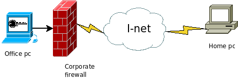
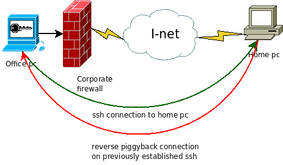
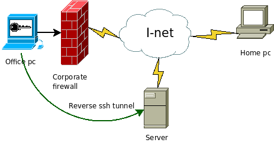
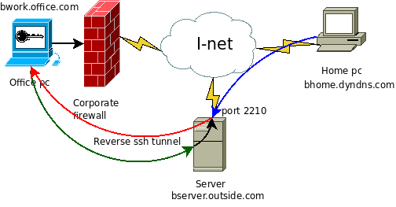
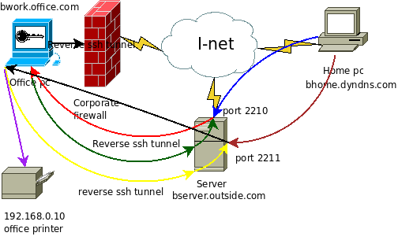

# Bypassing corporate firewall with reverse ssh port forwarding

[From toic.org](https://toic.org/blog/2009/reverse-ssh-port-forwarding)

Probably lots of you are behind some sort of very restrictive corporate firewall. Unable to access your office pc from home because of firewall policies. In normal cases this scenario is more than welcomed. No outsiders should be allowed to access internal parts of secure network! Ideally companies will setup secure VPN access allowing its employees to access their work computers and do some work remotely. What if you aren't one of the lucky ones having such option? You desperately need to access your office pc?

## The problem



As shown on the picture above, we have our office PC behind very restrictive corporate firewall connected to Internet. Firewall will not allow any traffic originating from Internet to internal networ k except previously initiated traffic. Meaning you can contact remote hosts on Internet from your office PC and they can respond, but remote computers can't initiate connection to your office PC. Thi s is of course huge problem if you have to access your work materials on office PC from your home. Additionally corporate firewall will only allow certain traffic from your office PC to remote hosts. Meaning you can only establish FTP, SSH, HTTP, POP3... communications, all other ports are blocked.

### How can you access your office PC then?

One way is to setup corporate VPN access allowing secure connections to internal network. Another method is to setup a port forwarding on corporate firewall so it redirects certain ports to your offi ce PC. But if you don't have the means to accomplish any of this then the only way to do it is to use ssh tunnels and reverse port forwarding.

## The solution

If we can only contact remote hosts on certain ports, the solution would be to contact remote hosts via allowed port and piggyback the connection on already established link.



Something like shown on the picture above. Fortunately we can do this with ssh.

## Real life example

I will assume that home PC is connected via dynamically assigned IP address. First thing you will need to make sure you have ssh server installed on your home PC and it should be accessible from Inte rnet. If you have some NAT routers, be sure to forward port 22 to your home PC. Secondly you will need to setup a dyndns account so you can connect to your home PC regardless of IP address changes. N ow the goal will be to connect to that home ssh server from our office PC.

> For the purpose of this example i will name my home PC: bhome.dyndns.com Office computer name will be bwork.office.com bwork computer uses private IP range of 192.168.0.0/24 with address 192.168.0.100

So if the firewall is preventing outside connections to our bwork computer we must initiate connection from it.

We can do this with simple ssh command:
```
ssh -R 2210:localhost:22 bhome.dyndns.com
```
**So what just happened here?** We are initiating ssh connection **ssh** with reverse port forwarding option **-R** which will then open listening port **2210:** who is going to be forwarded back to **localhos**t's port **:22** an d all this will happen on remote computer **bhome.dyndns.com**.

This connection represents the green line in the diagram above, and it's a legit connection as far as corporate firewall is concerned.

Now if weopen up a terminal on bhome computer, and type in:
```
ssh -p 2210 localhost
```
we will try to connect to **localhost** (bhome.dyndns.com) on port **2210**. Since that port is setuped by remote ssh connection it will tunnel the request back via that link to the **bwork.office.com** computer. This is the red line on the diagram above. Looking from firewall's perspective it's a legit traffic, since it is responding traffic on already initiated link from **bwork** computer.

## Real life example 2

What if your home computer is not always on-line? Or perhaps you wish to access your office computer from multiple locations? For this you will have to have some dedicated server or VPS outside the c orporate firewall.



To accomplish this we will use the same command as previously, only this time we will open up a reverse ssh tunnel to remote server or VPS.

> For the purpose of this example we will name the server bserver.outside.com with IP 89.xxx.xx.4

```
ssh -R 2210:localhost:22 bserver.outside.com
```

again this will open up reverse ssh tunnel to the machine 89.xxx.xx.4 (bserver.outside.com). So when we login to the server and issue the command:

```
ssh -p 2210 localhost
```

we will end up with bwork computer's ssh login prompt.

**Can I use this previously established reverse ssh tunnel to the server to directly connect to my office computer?**

Of course, but some slight modifications are required. By default ssh tunnels only bind to local address, and can be accessible only locally. Meaning, in the example above, you can't just type:

```
ssh -p 2210 bserver.outside.com
```

on your home PC and be connected to your office PC!

If you run:

```
netstat -ntl
```

on bserver you will see that the port 2210 is only listening on 127.0.0.1 IP address. To get it listen on interface connected to Internet we must enable **GatewayPorts** option in ssh server's config uration. By default GatewayPorts are disabled in sshd, but we can simply enable them:

```
vim /etc/ssh/sshd_config
```

then add:

```
GatewayPorts clientspecified
```

save the file and restart sshd:

```
/etc/init.d/ssh restart
```

We could have just enable GatewayPorts by typing **On** instead of **clientspecified**, that would route any ssh tunnel to network interface. This way we can control which tunnel will be accessible f rom outside, and on which interface.

So if we initiate reverse ssh tunnel like this:

```
ssh -R 89.xxx.xx.4:2210:localhost:22 bserver.outside.com
```

we will have bserver listening on port 2210 on network interface bound to ip 89.xxx.xx.4 and forwarding all traffic via established tunnel to bwork computer. If you omit the 89.xxx.xx.4 address from the command above server will again listen on port 2210 only on local loopback interface. If you have multiple network interfaces on server be sure to select the one you can connect to. To enable listening port on all interfaces, just use IP 0.0.0.0 in the command above



Now when we run:

```
ssh -p 2210 bserver.outside.com
```

from our home PC we will initiate ssh connection on port **2210** towards server **bserver.outside.com** (blue line). Server will then forward that traffic to office PC (red line) via the previously established reverse ssh tunnel (green line).

> Of course you will have to open up port 2210 on server's firewall to be able to connect.

## Some more fun with reverse tunnels

Fun doesn't stops there. Say I have a printer behind that corporate firewall. How can i connect to it? Easy... remember the first example? the command ssh -R is taking 5 arguments of which 4 are mandatory:

```
ssh -R [bind_address:]port:host:hostport
```

**bind_address** is the network address on which **port** will be listening, and forwarded to **host** (connected to network from which reverse tunnel originated) on **hostport**.

so if we issue the command like this on our bwork pc:

```
ssh -R 89.xxx.xx.4:2211:192.168.0.10:631 bserver.outside.com
```

we will get something like this:



so again we have previously established reverse ssh tunnel listening on port **2210** to channel the ssh connection towards office PC. Now with this new command we established the reverse ssh tunnel (yellow line) towards bserver which will listen for incoming connections on port **2211**. When the home pc makes a data connection to port **2211** on bserver (brown line) it is t hen forwarded to office PC (**black line**) which is then redirected towards office printer at address **192.168.0.10** on port **631** (purple line). Remember, all this traffic is passing trough corporate firewall as legit traffic, even if the illustration perhaps shows otherwise.

## Automating the task

By now we should have covered the basics on how to bypass corporate firewall in order to get to your office computer and network equipment. Now, ssh -R isn't really practical, it consumes one terminal, and as soon as it shuts down there is no tunnel and no outside connectivity for that matter. The easiest thing to do is putting a cron jo b that will connect to remote server if the connection fails, office computer reboots etc.

First of all [generate ssh keys](https://toic.org/blog/2008/ssh-basics/), and add them to ssh-agent so that script won't ask you for remote server's password or local key phassphrase all the time.

Next we will add two extra parameters to our command **-N** and **-f** so that the connection goes into the background.

the command will look like:

```
ssh -N -f -R [bind_address:]port:host:hostport
```

next we need a shell script that will be triggered by the cron. For this example we will use the Real life example 2:

```
#!/bin/sh
COMMAND="ssh -N -f -R 89.xxx.xx.4:2210:localhost:22 bserver.outside.com"
pgrep -f -x "$COMMAND" > /dev/null 2>&1 || $COMMAND
```

Edit this code so it suits your needs, and save it in your home dir as **reverse_ssh_tunnel.sh**

Now we need to add a crontab entry which will trigger this script every 5 minutes:
```
crontab -e
```
and add:
```
*/5 * * * * /bin/sh /home/username/reverse_ssh_tunnel.sh
```
If you are connecting to different user name on remote server you can edit your commands so they look like:
```
ssh -R [bind_address]:port:host:host_port username@remote_host
```
Have fun and be safe!